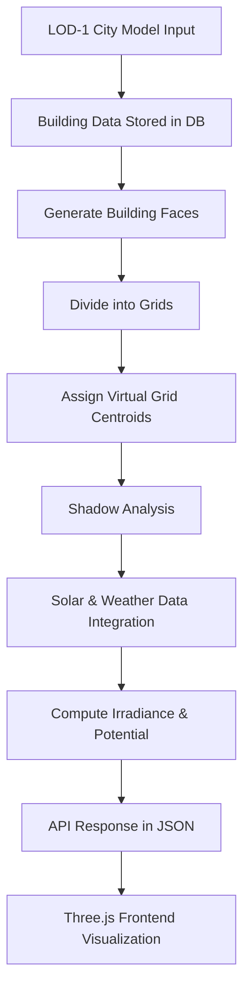
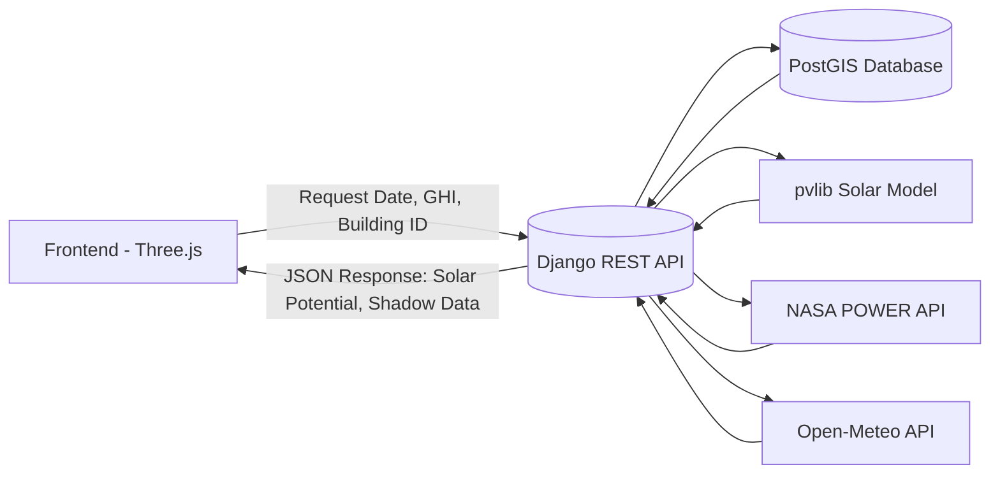
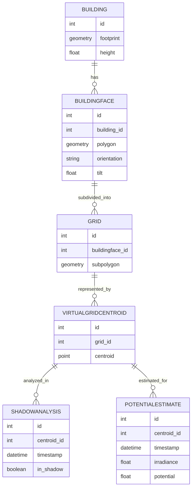

# 🌇 Building Integrated Photovoltaic (BIPV) Potential Assessment & Visualization using LOD-1 3D City Model

## 📌 Overview

This project develops an **interactive web application** for assessing **Building Integrated Photovoltaic (BIPV)** and **Rooftop PV potential** using **LOD-1 3D city models**.

* **Input Data**: LOD-1 model of **Ahmedabad**, derived from Cartosat-1/2/3.
* **Goal**: Estimate incident solar energy on **rooftops and building facades**, considering **shadows from adjacent buildings**.
* **Output**: 3D interactive visualization of solar potential, with energy estimates per grid, face, and building.

The application is intended for **policy-makers, solar solution providers, architects, and citizens**, and can be deployed on platforms like **VEDAS (ISRO)** for large-scale renewable energy planning.

---

## 🏗 Tech Stack

**Backend (API & Computation)**

* Django + GeoDjango (PostGIS for spatial data)
* pvlib (solar position + irradiance modeling)
* NASA POWER API (historical solar data)
* Open-Meteo API (cloud cover data)

**Frontend (Visualization)**

* Three.js (3D rendering of city models)
* HTML, CSS, JavaScript

**Database Models**

* `Building`: footprint + height
* `BuildingFace`: vertical walls + roof faces (3D polygons)
* `Grid`: face subdivided into grids
* `VirtualGridCentroid`: representative centroid per grid
* `ShadowAnalysis`: shadow state (hourly, per centroid)
* `PotentialEstimate`: irradiance + solar potential

---

## 🔄 Workflow / Approach

### 1. Input: LOD-1 City Model

* Ahmedabad buildings provided in **polygon footprints + heights**.
* Stored in database (`Building` model).

### 2. Building Face Generation

* Each footprint extruded vertically → **3D walls + roof** (`BuildingFace`).
* Orientation & tilt computed.

### 3. Grid Generation

* Each face divided into **4 equal grids** (`Grid`).
* Used to localize solar potential estimation.

### 4. Virtual Centroid Assignment

* Each grid assigned a **centroid** (`VirtualGridCentroid`).
* Centroid represents the grid for shadow & irradiance calculations.

### 5. Shadow Analysis

* Hourly shadow presence stored in `ShadowAnalysis`.
* Determined by relative positions of centroids & surrounding buildings.

### 6. Solar & Weather Data

* **Recent Dates (≤6 months)** → pvlib (clear-sky model).
* **Older Dates** → NASA POWER API (hourly GHI, DNI, DHI).
* **Cloud Factor** → Open-Meteo API (hourly cloud cover).

### 7. Irradiance & Potential Calculation

* For each grid centroid, compute **hourly irradiance** using:

  * Direct Normal Irradiance (DNI)
  * Diffuse Horizontal Irradiance (DHI)
  * Surface orientation (tilt & azimuth)
  * Cloud cover factor
  * Shadow factor
* Convert irradiance → **kWh potential** for grid, face, and building.

### 8. Visualization

* Frontend renders 3D buildings with Three.js.
* Building faces color-coded based on **solar potential**.
* User selects **date + daily GHI**, system recomputes results.

---

## 📊 Workflow Diagram



---

## 🌐 API Architecture



---

## 🗂 Data Model (ER Diagram)



---

## ⚡ Features

* 📍 **LOD-1 3D city model integration** (building extrusion + orientation).
* 🌞 **Hourly shadow simulation** per building grid.
* ☁️ **Weather & solar data integration** (NASA POWER, pvlib, Open-Meteo).
* 📊 **Grid-level, Face-level, and Building-level solar potential** estimation.
* 🎨 **Interactive 3D visualization** using Three.js.
* 🗂 **REST APIs** to fetch solar potential, shadow data, and building attributes.

---

## 🛠 Setup Instructions

### 1. Clone Repository

```bash
git clone <your_repo_url>
cd bipv-assessment
```

### 2. Install Dependencies

```bash
pip install -r requirements.txt
```

### 3. Setup Database

* Install **PostgreSQL** with **PostGIS** extension.
* Create database:

```sql
CREATE DATABASE bipv_db;
CREATE EXTENSION postgis;
```

* Update `settings.py` with DB credentials.
* Run migrations:

```bash
python manage.py migrate
```

### 4. Load Building Data

```bash
python manage.py loaddata buildings.json
```

### 5. Generate Faces, Grids, Centroids

```bash
python manage.py generate_building_faces
python manage.py grids_4perface_generate
python manage.py generate_virtual_grid_centroids
```

### 6. Run Development Server

```bash
python manage.py runserver
```

---

## 🔌 API Endpoints

### **1. Daily Solar Potential**

`/api/building/<id>/solar-potential/<YYYY-MM-DD>/`

* Returns total + per-face solar potential.

### **2. Hourly Solar Potential (per face/grid)**

`/api/building/<id>/solar-potential-hourly/<YYYY-MM-DD>/`

* Returns hourly irradiance & potential.

### **3. Hourly Shadow Data**

`/api/building/<id>/shadow/<month>/`

* Returns per-grid shadow status for each hour.

### **4. Monthly Solar Potential**

`/api/building/<id>/solar-potential-monthly/<year>/<month>/`

* Aggregated monthly average estimates.

---

## 📸 Visualization (Frontend)

* Built with **Three.js**.
* Features:

  * 3D navigation (zoom, pan, rotate).
  * Building faces highlighted with **heatmap colors** (low → high solar potential).
  * On-click: view **grid-wise breakdown** of potential.

---

## 📊 Example Output (API Response)

```json
{
  "building_id": 5203,
  "height": 15.0,
  "total_solar_potential": "220.45 kWh",
  "total_solar_irradiance": "4.65 kWh/m^2",
  "vertical_surface_BIPV": "85.23 kWh",
  "rooftop_potential_BIPV": "135.22 kWh",
  "faces": {
    "120": {
      "potential": "45.12 kWh",
      "irradiance": "3.23 kWh/m^2",
      "orientation": "East",
      "surface_area": "55.34 m^2",
      "grid00": {"potential": "10.12 kWh", "irradiance": "0.80 kWh/m^2"},
      "grid01": {"potential": "12.34 kWh", "irradiance": "0.90 kWh/m^2"}
    }
  }
}
```

---

## 🚀 Future Enhancements

* [ ] LOD-2/LOD-3 support (roof structures, windows).
* [ ] High-resolution solar potential mapping (more grids per face).
* [ ] Real-time weather + solar forecast integration.
* [ ] Automated report generation (PDF).
* [ ] User uploads own building footprint for analysis.

---

## 👥 Authors

* **TechDecks / Rajalakshmi Engineering College**
* Contact: *kiruthhik@gmail.com*
